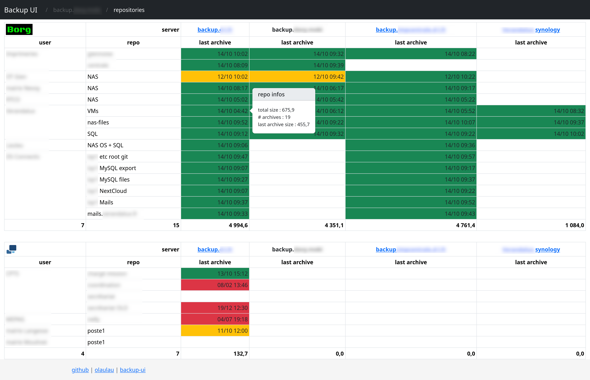
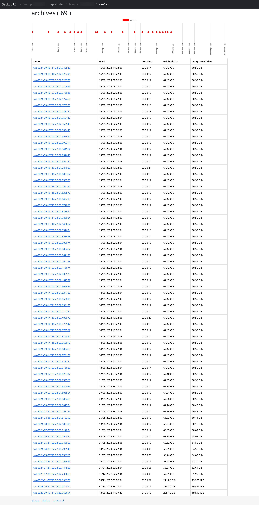

# description
display borg backups (borg & duplicati) informations so that you can easilly check your backups are running fine.

<a href="doc/repositories.png"></a> &nbsp; 
<a href="doc/archives.png"></a>
<br/>

## features
- borg
	- view repos infos from multiple servers
	- list repos and their details
	- list archives and their details
	- access raw archive informations
- (coming soon) duplicati
	- repo disk usage size
	- list archives (date)

<br/>
<br/>

# install
## requirements
- git
- borg (recent versions), on both client and server
- (recommended) borgmatic on the client, if you use borg client script
- duplicati-cli on the server
- webserver (recommended Apache >= 2.4)
- PHP (>= 7.4), composer
- npm

## compatibility
- Linux : tested on debian 12+
- Synology : tested on an old DS216j with DSM 7.1.1-42962 Update 5 (borg part)
	- you can find python, borg, node.js packages in community repo
	- download composer.phar from their website (use ```php8.0 composer.phar install```)
	- you may have to go ssh root to handle repo permissions correctly


## create a user (on the server)
```
adduser <user>
adduser www-data <user>
systemctl restart apache2
```

## web ui
```
git clone https://github.com/olaulau/backup-ui
composer i
npm i
```

## configure
```
cd backup
vim conf/conf.ini
	fill-in values
```

## usage
just go to ```https://<host>/backup/repositories``` with your browser

<br/>
<br/>

# borg client script
do all the stuff that client should do :
- run borgmatic commands
- fix permissions
- ask the web ui to update his cache

If you can't or don't wanna use this script, look at it and be sure to do all those things by yourself.  
As borgmatic is just a convenient wrapper for borg commands, you can just execute borg by yourself.

## install the borg client script (on the client)
```
cd bin/
rm borg_client.sh
wget https://raw.githubusercontent.com/olaulau/borg-ui/main/script/borg_client.sh
chmod u+x borg_client.sh
crontab -e
	0	*	*	*	*	bin/borg_client.sh <server> <user_name> <remo_name>
```

<br/>
<br/>

# technical informations
- all data are locally stored in a file-cache, so thatweb display are fast
- refresh of cache is push by the client script

## data structure
server > user > type > repo > archive

## library used
- [fat free framework](https://fatfreeframework.com/3.8/home) : PHP framework
- [bootstrap](https://getbootstrap.com/) : CSS framework
- [gabrielelana/byte-units](https://github.com/gabrielelana/byte-units) : size unit conversion & display
- [chart.js](https://www.chartjs.org/) : charts
